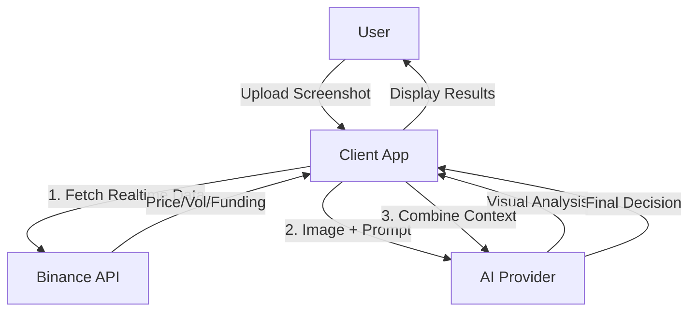

# K-Snap - AI Crypto Trading Assistant

> **Intelligent, Multi-modal Cryptocurrency Trading Decision System**

K-Snap uses advanced multi-modal AI models combined with real-time exchange data to provide professional technical analysis and trading suggestions based on chart screenshots.

## Key Features

- ** Screenshot Analysis**: Drag & drop or paste K-line charts. AI automatically identifies symbols, timeframes, and patterns.
- ** Multi-model Support**: Compatible with OpenRouter (Claude/Gemini/Llama) and OpenAI.
- ** Real-time Calibration**: Fetches live price, funding rates, and open interest from Binance to validate AI analysis.
- ** Professional Signals**: Generates Spot, Futures, and Options strategies with risk assessment.
- ** Privacy First**: API Keys are stored locally in your browser. No backend server required.

## Architecture



## Tech Stack

- **Frontend**: React, Vite, TypeScript
- **Styling**: TailwindCSS, Lucide Icons
- **AI Integration**: OpenAI SDK / Fetch API
- **Data Source**: Binance Public API

## Quick Start

### 1. Installation

```bash
pnpm install
```

### 2. Development

```bash
pnpm dev
# App will run at http://localhost:5173
```

### 3. Usage

1. Open the app in your browser.
2. Click **"Set API Key"** in the top right corner.
3. Enter your **OpenRouter** (Recommended) or **OpenAI** API Key.
4. Upload or paste a BTC chart screenshot.

## License

MIT
